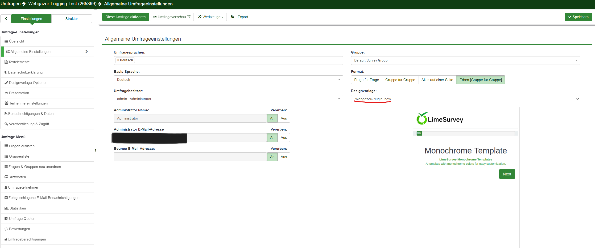
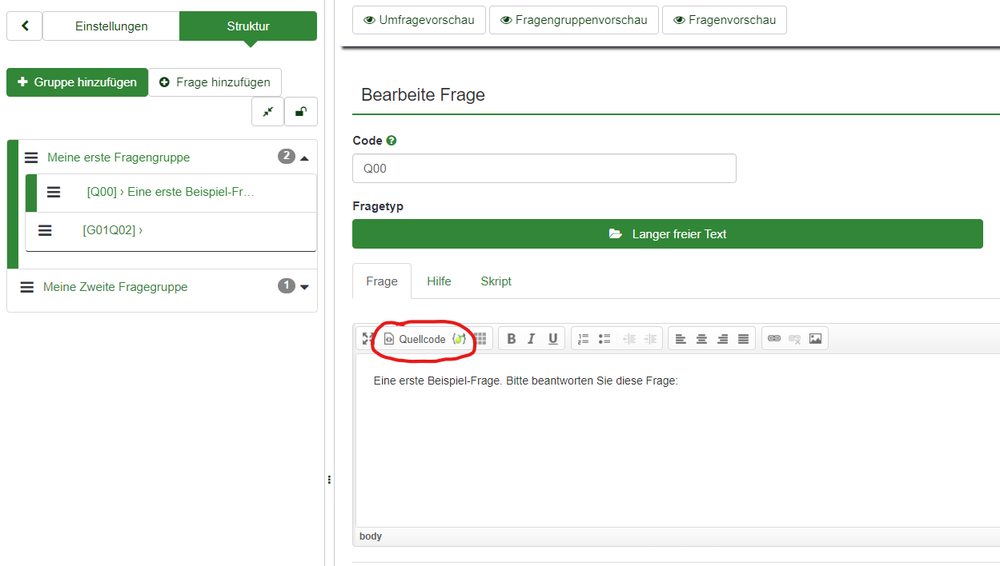
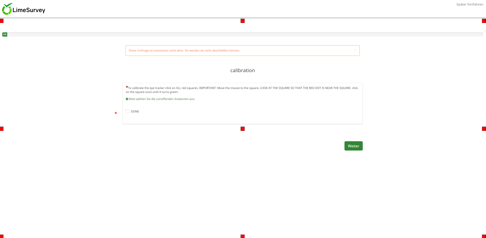
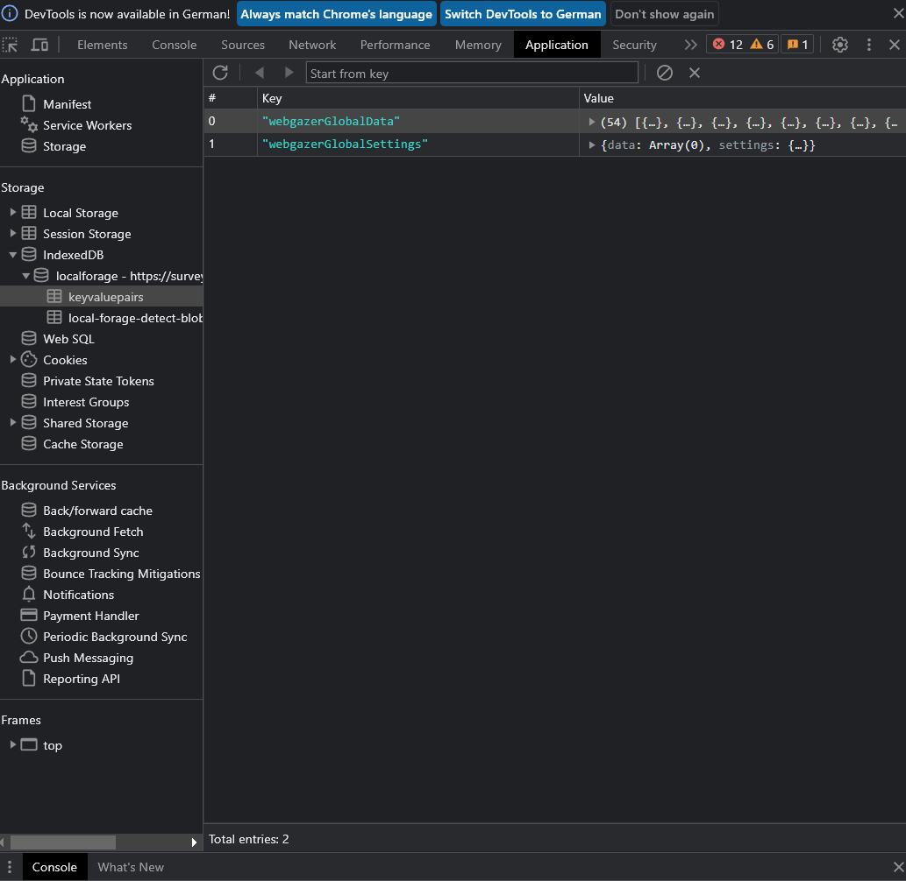

# Webgazer-Lime Tutorial


## Getting started

In this tutorial you will learn how to install and use the Webgazer Limesurvey plugin. For more references have a look at the [Webgazer.js](https://webgazer.cs.brown.edu/#examples) API.

## Install

For the installation an admin account is required, on the start page they navigate first to Design Templates. Then click Upload and Install and select the .zip file you find in this repository.

In the next step, open the General settings of the survey and select the design template you just uploaded.

You can now access the API via the webgazer keyword for any question in a script area.



## Usage
Edit a question of the question group for which you want to use the Webgazer plugin (you will need to add this Code once per Questiongroup). 


Then click on Source code to edit the question and add the following script:

```
<script>
  var prediction = webgazer.getCurrentPrediction();
    if (prediction) {
        var x = prediction.x;
        var y = prediction.y;
    }
  webgazer.setGazeListener(function(data, elapsedTime) {
        var webgazerVideoContainer = document.getElementById('webgazerVideoContainer');
        webgazerVideoContainer.style.display = 'none';
        if (data == null) {
            return;
        }
        var xprediction = data.x; //these x coordinates are relative to the viewport
        var yprediction = data.y; //these y coordinates are relative to the viewport
        localStorage.setItem("GazePredictionX", xprediction);
        localStorage.setItem("GazePredictionY", yprediction);
        }).begin();
</script>
```

This script starts the Webgazer and stores the prediction in the localStorage. The storage in the localStorage has the advantage that every other script, in other questions in this subgroup also have access to this data.

By using the commands:

```
      var retrievedGazeX = localStorage.getItem("GazePredictionX");
      var retrievedGazeY = localStorage.getItem("GazePredictionY");
```
you can access the gaze data at any time.

```
        var webgazerVideoContainer = document.getElementById('webgazerVideoContainer');
        webgazerVideoContainer.style.display = 'none';
```
Is used to remove the camera preview in the top left, which is produced by the Webgazer API

## Callibration process

The Webgazer must first be calibrated. This is done by placing the mouse cursor at different positions, looking at it and clicking.

The callibration data is then stored locally in the user's browser across sessions by [localforage](https://localforage.github.io/localForage/).

To calibrate the webgazer you need to add a question group that contains a question. This question group will use the following source code:  

```
To calibrate the eye tracker click on ALL red squares. IMPORTANT: Move the mouse to the square, LOOK AT THE SQUARE SO THAT THE RED DOT IS NEAR THE SQUARE. click on the square once until it turns green. <script>
   var prediction = webgazer.getCurrentPrediction();
   if (prediction) {
   var x = prediction.x;
   var y = prediction.y;
   }
   console.log(prediction.x);
         webgazer.setGazeListener(function(data, elapsedTime) {
             var webgazerVideoContainer = document.getElementById('webgazerVideoContainer');
             webgazerVideoContainer.style.display = 'none';
             if (data == null) {
                 return;
             }
             var xprediction = data.x; //these x coordinates are relative to the viewport
             var yprediction = data.y; //these y coordinates are relative to the viewport
             //console.log("xprediction", xprediction, "yprediction", yprediction); //elapsed time is based on time since begin was called
         }).begin();
   webgazer.clearData();
</script>
<style type="text/css">html, body {
   height: 100%;
   margin: 0;
   padding: 0;
   overflow: hidden; /* Prevent vertical scrollbar */
   }
   article {
   position: relative;
   width: 100%; /* Set width to 100% */
   height: 100%; /* Take up full viewport height */
   border: 1px solid black;
   }
   .custom-checkbox {
   position: absolute;
   width: 20px;
   height: 20px;
   background-color: red; /* Red color for unchecked checkboxes */
   appearance: none;
   -webkit-appearance: none;
   border: 1px solid black;
   }
   .custom-checkbox:checked {
   background-color: green; /* Green color for checked checkboxes */
   }
</style>
<script>
   // Function to create a custom checkbox
   function createCustomCheckbox(x, y) {
       const checkbox = document.createElement('input');
       checkbox.type = 'checkbox';
       checkbox.className = 'custom-checkbox';
       checkbox.style.left = x + 'px';
       checkbox.style.top = y + 'px';
       document.querySelector('article').appendChild(checkbox);
   }
   
   // Get article dimensions
   const article = document.querySelector('article');
   
   // Create custom checkboxes in each corner (top-left, top-right, bottom-left, bottom-right)
   createCustomCheckbox(0, 0);
   createCustomCheckbox(article.clientWidth - 20, 0);
   createCustomCheckbox(0, article.clientHeight - 20);
   createCustomCheckbox(article.clientWidth - 20, article.clientHeight - 20);
   
   // Create custom checkboxes in the middle of each edge (top, bottom, left, right)
   createCustomCheckbox(article.clientWidth / 2 - 10, 0);
   createCustomCheckbox(article.clientWidth / 2 - 10, article.clientHeight - 20);
   createCustomCheckbox(0, article.clientHeight / 2 - 10);
   createCustomCheckbox(article.clientWidth - 20, article.clientHeight / 2 - 10);
   
   // Create custom checkbox at the center
   createCustomCheckbox(article.clientWidth / 2 - 10, article.clientHeight / 2 - 10);
   
   
</script> <script>
   setInterval(function() {
           const checkboxes = document.querySelectorAll('.custom-checkbox');
   
      		let allChecked = true;
           checkboxes.forEach(checkbox => {
               if (!checkbox.checked) {
                   allChecked = false;
               }
           });
           console.log(allChecked);
           const donebutton = document.getElementById('answer265399X8157X110721SQ001');
   
           if (allChecked) {
             donebutton.checked = true;
           } else {
               donebutton.checked = false;
           }
       }, 100);
</script>
```

Note that the 'answer265399X8157X110721SQ001' must be modified to match the ID of the checkbox, and that the question must be a mandatory question with a checkbox as the answer.



FYI: For debugging, it can be helpful to delete this data manually on a regular basis, you can find it as shown in the screenshot. Delete the webgazerGlobalData and webgazerGlobalSettings entry.




## Example - Eyetracking + Firebase

This script can be used to send the ryetracking fata to a Firebase (Note that there is no API-KEY ;))

As you can see

     var retrievedGazeX = localStorage.getItem("GazePredictionX");
     var retrievedGazeY = localStorage.getItem("GazePredictionY");

retrieves the eyetracking-data, then the Data is put into an array, witch is converted into a CSV-File and send to the Firebase


```
<script src="https://www.gstatic.com/firebasejs/7.7.0/firebase-app.js"></script><script src="https://www.gstatic.com/firebasejs/7.7.0/firebase-storage.js"></script><script src="https://player.vimeo.com/api/player.js"></script><iframe allowfullscreen="" frameborder="0" height="274" id="video" sandbox="" src="XXXXXXXXXXXXXXXXXXXXXXXXXXXXXXXXXXXXXXXXXXXXXX width="640"></iframe><script>
   var prediction = webgazer.getCurrentPrediction();
   if (prediction) {
   var x = prediction.x;
   var y = prediction.y;
   }
         webgazer.setGazeListener(function(data, elapsedTime) {
             var webgazerVideoContainer = document.getElementById('webgazerVideoContainer');
             webgazerVideoContainer.style.display = 'none';
             if (data == null) {
                 return;
             }
             var xprediction = data.x; //these x coordinates are relative to the viewport
             var yprediction = data.y; //these y coordinates are relative to the viewport
           //console.log("xprediction:", xprediction);
           //console.log("yprediction:", yprediction);
           localStorage.setItem("GazePredictionX", xprediction);
           localStorage.setItem("GazePredictionY", yprediction);
         }).begin();
</script><script>
   var firebaseConfig = {
       apiKey: "XXXXXXXXXXXXXXXXXXXXXXXXXXXXXXXXXXXXXXXXXXXXXX,
       authDomain: "XXXXXXXXXXXXXXXXXXXXXXXXXXXXXXXXXXXXXXXXXXXXXX",
       projectId: "XXXXXXXXXXXXXXXXXXXXXXXXXXXXXXXXXXXXXXXXXXXXXX",
       storageBucket: "XXXXXXXXXXXXXXXXXXXXXXXXXXXXXXXXXXXXXXXXXXXXXX",
       messagingSenderId: "XXXXXXXXXXXXXXXXXXXXXXXXXXXXXXXXXXXXXXXXXXXXXX",
       appId: "XXXXXXXXXXXXXXXXXXXXXXXXXXXXXXXXXXXXXXXXXXXXXX"
   };
   
   var correctQid = "{VC01.qid}";
   var correctSgqa = "{VC01.sgqa}";
   var instrRead = "{INST01.sgqa}";
   var instrReadQid = "{INST01.qid}";
   var videoQid = "{VIDEO01.qid}";
   var correct;
   var videoContainer = "{VIDEO01.qid}"
   var video = document.getElementById('video');
   var supposedCurrentTime = 0;
   var isVideoFinished = false;
   var correctYes = document.getElementById('javatbd' + correctSgqa + 'Y');
   var correctNo = document.getElementById('javatbd' + correctSgqa + 'N');
   let iframe = document.querySelector('iframe');
   let player = new Vimeo.Player(iframe);
   let playing = false;
   let isFullscreen = false;
   let simulationTime = 0;
   let controls = false;
   let data = []; // Array to store the collected data
   
   function reloadFrame(){
   document.getElementById('video').src = document.getElementById('video').src;
   }
   
   function initialize() { 
   iframe.removeAttribute("sandbox");
   document.getElementById("ls-button-submit").style.display = "none";
     targList = document.getElementsByClassName("question-container");
   if (targList) {
   	for (var x = 1; x < targList.length; x++) {
     		targList[x].style.display = "none";
   }
   }
    // show video after instructions read
   document.getElementById('javatbd' + instrRead + 'Y').addEventListener('click', function(){
       document.getElementById("question" + videoContainer).style.display ="block";
    
   });
   
   document.getElementById('javatbd' + correctSgqa + 'Y').addEventListener('click', function(){
                document.getElementById("ls-button-submit").style.display = "inline-block";
           targList2 = document.getElementsByClassName("question-container");
         if (targList2) {
           for (var x = 2; x < targList2.length; x++) {
                 targList2[x].style.display = "inline-block";
             }
       }
   });
   
   document.getElementById('javatbd' + correctSgqa + 'N').addEventListener('click', function(){
    alert("Please reload the page");
   });
   
   // check for radio buttons
   document.getElementById("ls-button-submit").addEventListener('click', function(event){
     var counter = 0;
      radioList = document.getElementsByClassName("answertext");
         if (radioList) {
           for (var x = 0; x < radioList.length; x++) {
               inputList = radioList[x].childNodes;
                 inputList.forEach(input => {
                 if(input.value){
                   counter++;
                 }
               });
             }
       }
   //alert(counter + "  " + radioList.length);
   if(counter < radioList.length){
   event.preventDefault();
   alert("At least one question is missing. Please rate all questions");
   }
   });
   
   }
   document.addEventListener("DOMContentLoaded", function(event) {
   // DOM is ready, execute your code here
        initialize();
    reloadFrame();
   
   });
    firebase.initializeApp(firebaseConfig);
    console.log(firebase);
   
   
         player.on('play', function(e) {
             playing = true;
             //fullscreen();
             player.play();
             
            player.requestFullscreen().then(function() {
                 
            }).catch(function(error) {
              
            });
         });
   
   player.on('pause', function(e) {
             playing = false;
             // player.play();
             iframe.classList.remove(".disablehover")
             player.exitFullscreen().then(function() {
   
             }).catch(function(error) {
   
             });
             
         });
   
         player.on('ended', function(e){
               correct = document.getElementById("question" + correctQid);
           correct.style.display = "block";
           document.getElementById("question" + instrReadQid).style.display = "none";
           document.getElementById("question" + videoQid).style.display = "none";
      
           
             player.exitFullscreen().then(function() {
                      // Convert data to CSV format and save as a file
                          const csv = convertToCSV(data);
                       downloadCSV(csv, '{PROLIFICID.shown}_{GROUPNAME}.csv');
             }).catch(function(error) {
                 // an error occurred
             })
         });
   
   setInterval(function() {
   if (playing == true) {
   player.getCameraProps().then(function(cameraProps) {
   player.getCurrentTime().then(function(currentTime) {
     simulationTime = currentTime; // Update simulationTime with the resolved current timestamp
     var retrievedGazeX = localStorage.getItem("GazePredictionX");
     var retrievedGazeY = localStorage.getItem("GazePredictionY");
     var displayResX = window.screen.width;
   var displayResY = window.screen.height;
     data.push({ simulationTime, cameraProps, retrievedGazeX, retrievedGazeY, displayResX, displayResY}); // Store data in the array
     console.log(simulationTime, cameraProps, retrievedGazeX, retrievedGazeY, displayResX, displayResY);
   }).catch(function(error) {
     // Handle error if unable to get current time
   });
   }).catch(function(error) {
   // Handle error if unable to get camera properties
   });
   }
   }, 100);
     
   
   function convertToCSV(data) {
   const csvRows = [];
   const headers = ['video_timestamp', 'yaw', 'pitch', 'roll', 'gazeX', 'gazeY', 'displayResX', 'displayResY'];
   csvRows.push(headers.join(';'));
   
   for (const row of data) {
   const values = [
   row.simulationTime.toFixed(1),
   row.cameraProps.yaw,
   row.cameraProps.pitch,
   row.cameraProps.roll,
   row.retrievedGazeX,
   row.retrievedGazeY,
   row.displayResX,
   row.displayResY,
   ];
   csvRows.push(values.join(';'));
   }
   
   return csvRows.join('\n');
   }
   
   // Download CSV file
   function downloadCSV(csv, filename) {
   const csvBlob = new Blob([csv], { type: 'text/csv;charset=utf-8;' });
   const storageRef = firebase.storage().ref();
   const fileRef = storageRef.child("Daytime/Path/" + filename);
   
   fileRef.put(csvBlob)
   .then(function(snapshot) {
   console.log('CSV file uploaded to Firebase Storage successfully.');
   })
   .catch(function(error) {
   console.error('Error uploading CSV file to Firebase Storage:', error);
   });
   }
   
         // detect enter or exit fullscreen mode
         document.addEventListener('webkitfullscreenchange', fullscreenChange);
         document.addEventListener('mozfullscreenchange', fullscreenChange);
         document.addEventListener('fullscreenchange', fullscreenChange);
         document.addEventListener('MSFullscreenChange', fullscreenChange);
   
         function fullscreen() {
         // check if fullscreen mode is available
         if (document.fullscreenEnabled || 
             document.webkitFullscreenEnabled || 
             document.mozFullScreenEnabled ||
             document.msFullscreenEnabled) {
             
             // which element will be fullscreen
             var iframe = document.querySelector('iframe');
             // Do fullscreen
             if (iframe.requestFullscreen) {
             iframe.requestFullscreen();
             } else if (iframe.webkitRequestFullscreen) {
             iframe.webkitRequestFullscreen();
             } else if (iframe.mozRequestFullScreen) {
             iframe.mozRequestFullScreen();
             } else if (iframe.msRequestFullscreen) {
             iframe.msRequestFullscreen();
             }
         }
         else {
             document.querySelector('.error').innerHTML = 'Your browser is not supported';
         }
         }
   
         function fullscreenChange() {
             isFullscreen = !isFullscreen;
             if(isFullscreen == false){
                 player.pause()
             }
         }
   
         
</script>
```